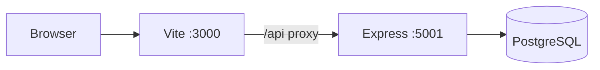
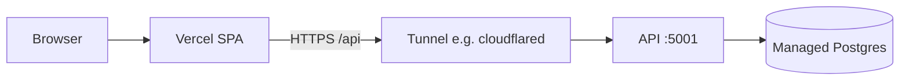

# Web-Based Attendance

HR and attendance for Indonesian teams: GPS check-in/out against office locations, payroll (slip export), leave, loans, and field operations (petugas lapangan delivery codes and omset).

**Fresh install demo login:** `admin` / `Admin123456` and `employee` / `Employee123456`. Change these before any shared or production use.

| Piece | Stack |
|-------|--------|
| UI | React 19, Vite 6, Tailwind, React Router 7, i18next (EN / ID) |
| API | Node.js, Express 5, PostgreSQL (`pg`), JWT + refresh, CSRF on writes |
| Data | PostgreSQL 16 — migrations and demo seed run when the API starts successfully |

**API base path:** `/api/v1` · **OpenAPI UI:** `http://127.0.0.1:5001/api-docs` (adjust host in production)

---

## Contents

1. [Quick start (local)](#quick-start-local)
2. [How the pieces connect](#how-the-pieces-connect)
3. [Roles](#roles)
4. [Using the web app](#using-the-web-app)
5. [Payroll period](#payroll-period)
6. [GPS and attendance rules](#gps-and-attendance-rules)
7. [Configuration](#configuration)
8. [HTTP API](#http-api)
9. [Troubleshooting](#troubleshooting)
10. [Production](#production)
11. [Development](#development)

---

## Quick start (local)

**You need:** Node.js (LTS), npm, Docker (or your own Postgres).

1. **Database** — from the repo root:

   ```bash
   docker compose up -d
   ```

   Default DB: user `attendance`, password `attendance`, database `attendance`, port `5432`.

2. **Backend env**

   ```bash
   cp backend/.env.example backend/.env
   ```

   Ensure `DATABASE_URL` matches your Postgres.

3. **Install**

   ```bash
   cd backend && npm install
   cd ../frontend && npm install
   ```

4. **Run API** (applies schema + seed on first healthy start)

   ```bash
   cd backend && npm start
   ```

   Health: `GET http://127.0.0.1:5001/health`

5. **Run UI**

   ```bash
   cd frontend && npm run dev
   ```

   Open **http://localhost:3000**. The dev server proxies `/api` to the API on port **5001**.

Optional API watch mode: `cd backend && npm run dev` (nodemon).

---

## How the pieces connect



In production you usually put HTTPS in front of the UI and API (same host or split). Employees need **HTTPS** for GPS in the browser (except on `localhost`).

---

## Roles

Each non-admin login is tied to an **employee profile** (name, employee code, HR fields).

| Role | Code | Attendance | Payroll (typical) |
|------|------|------------|-------------------|
| Administrator | `admin` | — | Full admin console |
| Staff kantor | `employee` | 2 or 4 clocks/day; optional remote work | Monthly; absence rules |
| Petugas lapangan | `field_officer` | One in/out per day; delivery data on checkout; multiple sites | Daily wage + delivery omset |
| Urusan umum | `general_affairs` | One in/out per day | Daily wage (no delivery omset) |
| Cleaning | `umum` | One check-in per day (auto close) | Monthly with absence deductions |
| Accounting | `accounting` | Custom work hours | Monthly (staff-kantor style) |
| Head of finance | `head_of_finance` | None — admin enters payroll | Manual slip; can open field omset report |

After login, **admin** goes to `/admin`. Everyone with a staff or finance portal goes to `/employee` (payslips, clock, loans, leave as applicable).

---

## Using the web app

### Language

Use **EN** / **ID** in the header. Preference is stored in the browser (i18next).

### Sign in and sign out

1. Open `/login` (or `/`, which redirects there).
2. Sign in with username and password.
3. The app keeps access and refresh tokens in `localStorage`, refreshes access when it expires, and sends CSRF headers on mutating requests when CSRF is enabled.
4. **Sign out** clears tokens and revokes the refresh token when possible.

### Staff dashboard (`/employee`)

- **Today:** status, shift label, progress toward required clock events (2 = one segment; 4 = split shift).
- **Week hours:** rolling total from recorded time.
- **Check in / Check out:** allow browser **location**; optional **Remote work day** on check-in when the account allows it (skips distance check, not GPS quality or anti-spoof checks).
- **My payroll**, **loans**, **leave**, and **history** when your role uses them.

**Common blockers**

| Message / situation | What to do |
|-------------------|------------|
| No office assigned | Admin sets office (or sites for petugas lapangan). |
| Not within radius | Move closer, improve GPS fix, or verify office pin and `OFFICE_RADIUS_METERS`. |
| GPS accuracy too poor | Better sky view; limit is `MAX_GPS_ACCURACY_METERS`. |
| Device clock skew | Enable automatic date/time. |
| Speed rejected | Prior and current fixes imply impossible travel. |

### Admin areas

| Path | Purpose |
|------|---------|
| `/admin` | Overview, users, attendance list and edits |
| `/admin/payroll` | Generate payroll, allowances, per-employee edits, slip export |
| `/admin/field` | Locations (Google Maps links), checkout codes, pabrik rates |
| `/admin/leave` | Approve/reject leave, quotas, documents |
| `/admin/loans` | Loan approvals (potong gaji on payroll) |
| `/admin/corrections` | Pending attendance corrections |
| `/admin/reports` | Department analytics, audit log, activity log |
| `/finance/field-omset` | Field delivery omset (admin and head of finance) |

**Dashboard exports**

- **Professional report** (`absen_hjs.xlsx`) — Indonesian summary workbook.
- **Excel export** (`attendance.xlsx`) — full attendance export.

**Users (admin)**

- Create **employee** accounts with full name, office, password policy, optional remote work, and clock mode (**two** clocks = one segment with reference shift 07:15–16:00 and 60‑minute break for late/hours; **four** clocks = morning and afternoon segments).
- Petugas lapangan roles use field ops for sites and checkout configuration.

### Password rules

At least `PASSWORD_MIN_LENGTH` characters (default **6**), letters and numbers only (`backend/src/utils/passwordPolicy.js`).

---

## Payroll period

Payroll months use a **25th–24th** window: pay month `YYYY-MM` covers **25th of the previous calendar month** through **24th** of the pay month (example: May 2026 → 25 Apr–24 May). **Days attended** come from check-ins in that range. Slips show the same range on the **Periode** line.

Generate or refresh from **Payroll** → choose month → **Generate / refresh from attendance**. Loan deductions apply from approved active loans. Employees see finalized rows under **My payroll** after you generate that month.

---

## GPS and attendance rules

**On-site check-in** (remote work disabled): distance from the assigned office to reported lat/lng must be within

`OFFICE_RADIUS_METERS` + min(reported accuracy, `OFFICE_RADIUS_GPS_BUFFER_CAP_METERS`).

**Every clock event**

- GPS accuracy ≤ `MAX_GPS_ACCURACY_METERS`
- Client timestamp within `MAX_CLIENT_CLOCK_SKEW_MS` of server time
- If a previous fix exists, implied speed ≤ `MAX_IMPOSSIBLE_SPEED_MPS`

**Statuses:** late at check-in vs shift start; early leave possible at check-out. Logic lives in `backend/src/services/attendanceService.js` and `backend/src/utils/`.

Calendar “today” for attendance uses `ATTENDANCE_CALENDAR_TZ` (default `Asia/Jakarta` in `.env.example`).

---

## Configuration

Copy `backend/.env.example` to `backend/.env`. Important variables:

| Variable | Role |
|----------|------|
| `DATABASE_URL` | PostgreSQL connection string (required) |
| `PORT` | API port (default **5001**) |
| `JWT_SECRET`, `COOKIE_SECRET` | Signing secrets — **set strong values in production** |
| `ALLOWED_ORIGINS` | Comma-separated UI origins for CORS |
| `COOKIE_SAME_SITE` | Use `none` when UI and API are on different sites (e.g. Vercel + tunnel) |
| `DATABASE_SSL` | `true` or auto for Neon / Supabase URLs |
| `SERVE_FRONTEND` | `false` when the API does not serve `frontend/dist` |
| `CSRF_ENABLED` | Keep `true` in production |
| `OFFICE_RADIUS_*`, `MAX_GPS_*`, `MAX_CLIENT_CLOCK_SKEW_MS`, `MAX_IMPOSSIBLE_SPEED_MPS` | Attendance trust and radius |
| `ACCESS_TOKEN_TTL_SEC`, `REFRESH_TOKEN_TTL_DAYS` | Session lifetime |
| `RATE_LIMIT_*` | Global API rate limit |
| `ATTENDANCE_CALENDAR_TZ` | Office calendar day for attendance |
| `PAYROLL_COMPANY_NAME` | Name on exported slips |

Frontend build-time: `VITE_API_BASE` (default `/api`) — set to `https://<api-host>/api` when the UI is not served behind the same reverse proxy.

---

## HTTP API

- **Swagger:** `http://<api-host>:<port>/api-docs`
- **CSRF:** `GET /api/v1/auth/csrf-token` before login; send `X-CSRF-Token` on POST/PUT/DELETE when CSRF is enabled (login also returns a token for cookie-blocked browsers).
- **Auth:** `POST /api/v1/auth/login`, `POST /api/v1/auth/refresh`, `POST /api/v1/auth/logout`
- **Authenticated calls:** `Authorization: Bearer <access_token>`

Some endpoints (e.g. departments, overtime request queues) exist on the API without a dedicated screen; use Swagger or **Reports** for analytics and logs that are already in the UI.

---

## Troubleshooting

| Symptom | Check |
|---------|--------|
| API exits on startup | Postgres up? `DATABASE_URL`? Port 5432 free? |
| UI network errors | API running? Use **http://localhost:3000** in dev so `/api` hits Vite’s proxy. |
| CORS | Add UI origin to `ALLOWED_ORIGINS`. |
| 403 “security token” on POST | Call CSRF bootstrap before login; send `X-CSRF-Token`; match `ALLOWED_ORIGINS`; redeploy API after env changes. |
| Login 405 on Vercel | `VITE_API_BASE` must be `https://<api>/api` — rebuild/redeploy frontend. |
| Always outside radius | Office coordinates, radius env vars, indoor GPS. |
| Cannot clock | Office assigned? Day already complete? Open session waiting for checkout? |

**Tests (backend):** `cd backend && npm test`

---

## Production

### Split stack (Vercel + API on your PC + managed Postgres)

Typical for a small team:

| Layer | Where |
|-------|--------|
| Frontend | [Vercel](https://vercel.com) — root directory `frontend`, Vite build → `dist` |
| API | Your PC or VPS — `backend/` with production `.env` |
| Database | [Supabase](https://supabase.com) or [Neon](https://neon.tech) — use a **session/direct** pooler on port **5432** for this long-running Node app |



1. Create Postgres; set `DATABASE_URL` on the API host (SSL auto for common hosted URLs).
2. `cp backend/.env.production-local.example backend/.env` — set secrets, `ALLOWED_ORIGINS`, `COOKIE_SAME_SITE=none`, `SERVE_FRONTEND=false`.
3. Start API; tunnel port **5001**; verify `https://<tunnel>/health`.
4. Vercel env **`VITE_API_BASE`** = `https://<tunnel>/api`; redeploy.
5. Change demo passwords; test check-in on a phone over HTTPS.

Env reference: `deploy/split-stack.env.example`.

**Windows PC auto-start, tunnel URL sync, and deploy scripts:** [deploy/windows-split-stack.md](deploy/windows-split-stack.md).

**Backend deploy via GitHub Actions:** `.github/workflows/deploy-backend.yml` + `scripts/setup-github-deploy.ps1`.

### Single VPS (Docker + Caddy)

One machine with HTTPS:

1. DNS **A** record to the VPS; ports **80** / **443** open.
2. `cp .env.production.example .env.production` — set `DOMAIN`, `POSTGRES_PASSWORD`, `JWT_SECRET`.
3. From repo root:

   ```bash
   docker compose -f docker-compose.prod.yml --env-file .env.production up -d --build
   ```

   Site: `https://<DOMAIN>` · API: `https://<DOMAIN>/api/v1` · Swagger: `https://<DOMAIN>/api-docs`

Updates: `git pull` and re-run the compose command.

### Quick HTTPS test without a domain

Build the UI (`cd frontend && npm run build`), run API with `SERVE_FRONTEND=true`, expose with Cloudflare Tunnel or ngrok, add the public origin to `ALLOWED_ORIGINS`.

---

## Development

```bash
cd backend && npm run dev   # nodemon
cd frontend && npm run dev  # Vite :3000
cd backend && npm test      # node --test
```

Production UI only: `cd frontend && npm run build` → output in `frontend/dist`.

### Demo office (seed)

Seed creates **RS Darmo** from:

`https://maps.app.goo.gl/x9nEcHGRREfzCiwC9`

Admins can add sites by pasting Google Maps links; coordinates are resolved in `backend/src/utils/mapsLink.js`.

### Security checklist (production)

- Replace demo passwords and set strong `JWT_SECRET` / `COOKIE_SECRET`.
- Use HTTPS for any real GPS check-in.
- Restrict `ALLOWED_ORIGINS` to your real UI hosts.
- Keep `CSRF_ENABLED=true`.

---

*Operator manual for this repository. For script-level Windows operations, see [deploy/windows-split-stack.md](deploy/windows-split-stack.md).*
