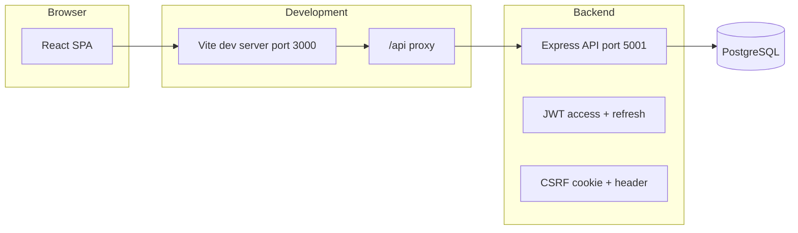
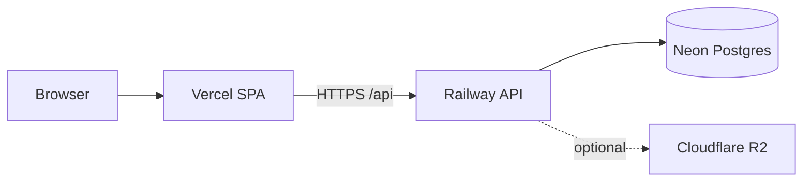

# Web-Based Attendance System

This document is the **operator and user manual** for the Web-Based Attendance System: what it does, how to install and configure it, and how to use the web application day to day.

Main User:
admin pass admin123

---

## 1. What this system is

The Web-Based Attendance System is a **full-stack office attendance** application. It lets **employees** record check-in and check-out with **GPS verification** against configured **office locations**, and gives **administrators** tools to manage users, offices, and attendance data.

**Typical use**

- Employees open the site on a phone or laptop, sign in, and use one button to **check in** or **check out** (the app chooses the correct action based on whether they already have an open session).
- Optionally, on check-in only, they can mark the day as **remote work** if the administrator has allowed it for their account.
- Administrators maintain **offices** (from Google Maps links), **user accounts**, and **optional split-shift schedules**, and can **export** attendance to Excel and view **dashboard statistics**.

**Roles**

| Role       | Purpose |
|-----------|---------|
| **admin** | Manage offices and users, view all attendance, run exports, see organization dashboard. |
| **employee** | Clock in/out for themselves, see today’s status, weekly hours, and personal history. Each employee login is tied to an **employee profile** (name, employee code, and HR-related fields in the database). |

**Important technical facts**

- Data is stored in **PostgreSQL** (not SQLite).
- The backend runs **database migrations and demo seed data automatically on startup** when the server starts successfully.
- The API is versioned under **`/api/v1`** and is documented with **Swagger UI** at **`/api-docs`** on the backend host.

---

## 2. Architecture at a glance



- **Frontend**: React (Vite), Tailwind CSS, React Router, i18next (English / Indonesian), Recharts on the admin dashboard.
- **Backend**: Node.js, Express 5, `pg` (PostgreSQL), JWT authentication, CSRF protection for mutating requests, optional request activity logging, rate limiting.
- **Integration**: In development, the frontend calls **`/api/...`**, which Vite **proxies** to `http://127.0.0.1:5001` so cookies and paths align.

---

## 3. Prerequisites

- **Node.js** (current LTS recommended) and **npm**.
- **PostgreSQL 16** (or compatible), either:
  - via **Docker** (recommended for local development), or  
  - a local install whose connection string you put in `backend/.env`.

---

## 4. Installation

### 4.1 Get the code

Clone this repository to your machine.

### 4.2 Start PostgreSQL

From the **repository root**:

```bash
docker compose up -d
```

This starts PostgreSQL **16** with:

- user: `attendance`  
- password: `attendance`  
- database: `attendance`  
- port: **5432**

(Adjust if you use your own Postgres instance.)

### 4.3 Configure the backend

```bash
cd backend
cp .env.example .env
```

Edit **`backend/.env`** as needed (see [Section 6](#6-configuration-reference-backendenv)). At minimum, ensure **`DATABASE_URL`** matches your database.

### 4.4 Install dependencies

```bash
cd backend && npm install
cd ../frontend && npm install
```

### 4.5 First startup (migrations and seed)

Starting the backend **runs migrations and seed data** (`backend/src/db/migrate.js`):

```bash
cd backend && npm start
```

If Postgres is not reachable, the server prints diagnostic hints (for example: start Docker Compose or create the role/database manually).

---

## 5. Running the application

### 5.1 Development (recommended)

**Terminal 1 — API**

```bash
cd backend && npm start
```

Default API URL: **`http://127.0.0.1:5001`**

- Health check: `GET http://127.0.0.1:5001/health`
- OpenAPI UI: `http://127.0.0.1:5001/api-docs`

**Terminal 2 — Web UI**

```bash
cd frontend && npm run dev
```

The Vite dev server listens on **port 3000** and proxies **`/api`** to the backend (`frontend/vite.config.js`).

Open **`http://localhost:3000`** in the browser.

### 5.2 Optional: backend in watch mode

```bash
cd backend && npm run dev
```

(requires `nodemon`)

### 5.3 Production-style frontend build

```bash
cd frontend && npm run build
```

The static output is under **`frontend/dist`**. If the UI is **not** served from the same origin as the API, set **`VITE_API_BASE`** at build time to the full API prefix (for example the public URL that serves `/api/v1`). The default in code is **`/api`**, which assumes a reverse proxy or same-host deployment.

---

## 6. Configuration reference (`backend/.env`)

| Variable | Typical meaning |
|----------|------------------|
| `PORT` | API port (default **5001**). |
| `NODE_ENV` | `development` or `production`. |
| `DATABASE_URL` | PostgreSQL connection string (required for a real database). |
| `JWT_SECRET` | Secret for signing access tokens (**change in production**). |
| `COOKIE_SECRET` | Secret for signed cookies (CSRF); defaults to `JWT_SECRET` if unset. |
| `ALLOWED_ORIGINS` | Comma-separated browser origins allowed by CORS (e.g. `http://localhost:3000`). Empty means permissive for origins (still subject to browser rules). |
| `COOKIE_SAME_SITE` | CSRF cookie `SameSite` (`lax` locally; use **`none`** when UI and API are on different hosts, e.g. Vercel + Railway). |
| `DATABASE_SSL` | Set to `true` to force TLS to Postgres (auto-enabled for Neon URLs and `sslmode=require`). |
| `SERVE_FRONTEND` | `false` when the API does not serve `frontend/dist` (split hosting). |
| `CSRF_ENABLED` | Set to `false` to disable CSRF checks (not recommended in production). |
| `ACTIVITY_LOG_ENABLED` | Set to `false` to disable HTTP activity logging middleware. |
| `ACCESS_TOKEN_TTL_SEC` | Access token lifetime in seconds (default **900** = 15 minutes). |
| `REFRESH_TOKEN_TTL_DAYS` | Refresh token lifetime. |
| `BCRYPT_ROUNDS` | Cost factor for password hashing. |
| `PASSWORD_MIN_LENGTH` | Minimum password length (default **6**). Passwords must be letters and numbers only. |
| `OFFICE_RADIUS_METERS` | Base allowed distance from the office pin for on-site check-in (default **350** m in `.env.example`). |
| `OFFICE_RADIUS_GPS_BUFFER_CAP_METERS` | Extra tolerance from GPS uncertainty, capped (see [Section 10](#10-attendance-and-gps-rules)). |
| `MAX_GPS_ACCURACY_METERS` | Reject clock events if reported accuracy is worse than this (default **250** m). |
| `MAX_CLIENT_CLOCK_SKEW_MS` | Reject if device time differs from server by more than this (default **5 minutes**). |
| `MAX_IMPOSSIBLE_SPEED_MPS` | Reject if implied speed from last fix to current fix exceeds this (default **50** m/s). |
| `RATE_LIMIT_WINDOW_MS` / `RATE_LIMIT_MAX` | Global API rate limit window and max hits. |
| `LOG_LEVEL` | Winston log level (`info`, etc.). |

---

## 7. Default demo accounts (fresh install)

After a successful first migration + seed, these accounts exist (see comments in `backend/.env.example`):

| Username   | Password            | Role     |
|-----------|---------------------|----------|
| `admin`   | `Admin123456`   | admin    |
| `employee`| `Employee123456` | employee |

The demo employee is linked to profile **`EMP001`** / **Demo Employee** and to the first office in the database (seed includes **RS Darmo** with coordinates from a Google Maps short link).

**Security**

- Change passwords immediately in any shared or production environment.
- Set strong, unique **`JWT_SECRET`** and **`COOKIE_SECRET`**.

---

## 8. Using the web application

### 8.1 Language

Use **EN** and **ID** in the header to switch **English** and **Indonesian**. Preference is handled by i18next in the browser.

### 8.2 Login

1. Open **`/login`** (or the site root, which redirects to login).
2. Enter **username** and **password**.
3. On success:
   - **admin** → `/admin`
   - **employee** → `/employee`

The app stores the **access token** and **refresh token** in `localStorage` and sends the access token on API requests. If the access token expires, the client attempts a **refresh** flow automatically.

### 8.3 Logout

Use **Logout** on the dashboard. The client calls the logout endpoint with the refresh token when possible, then clears local storage.

### 8.4 Employee dashboard (`/employee`)

**What you see**

- **Today’s status**: current attendance status, expected shift label, and progress toward the number of clock events required today (**two** for a single-segment day = one in + one out; **four** for a split day = two segments × in/out).
- **Week hours**: rolling sum of recorded work hours for the week.
- **Clock actions**: assigned office name, optional **Remote work day** checkbox (only on check-in and only if allowed), and the main **Check in / Check out** button.
- **My payroll**: monthly salary rows after an administrator generates payroll (days attended, basic pay, deductions, final pay).
- **Loans**: submit loan requests and track repayment (potong gaji) once payroll is run.
- **History**: past attendance rows with office name, status, and timestamps.

**How to check in or out**

1. Allow the browser to use **location** when prompted (high accuracy is requested).
2. If you are checking **in** and your account allows remote work, decide whether to enable **Remote work day**:
   - **Enabled**: GPS distance to the office is **not** enforced (you are still subject to GPS quality, clock skew, and speed checks).
   - **Disabled**: you must be within the configured **radius** of your assigned office (see [Section 10](#10-attendance-and-gps-rules)).
3. Press the main button. The label shows **Check in**, **Check out**, or **Day complete** depending on state.

**Typical errors (employees)**

- **No office assigned**: an admin must set your office on your user account.
- **Not within radius**: move closer, wait for a better GPS fix, or ask an admin to verify the office map pin / radius settings.
- **GPS accuracy too poor**: go outdoors or near a window; accuracy must be at or better than `MAX_GPS_ACCURACY_METERS`.
- **Device clock skew**: set automatic date/time on the device.
- **Movement speed rejected**: can occur if the previous and current locations imply impossible travel in the elapsed time.

### 8.5 Admin dashboard (`/admin`)

**Overview**

- **Summary cards**: total active employees, present-like today, late today, absent today (absence is derived as employees who have not checked in today versus headcount).
- **Attendance chart**: last **30 days** of present-like vs late counts.
- **Payroll summary**: recent periods with row counts and totals, plus a link to **Payroll** (`/admin/payroll`).

**Exports**

- **Professional report** (`absen_hjs.xlsx`): Indonesian-formatted summary workbook (name, working days, etc.) for a default rolling window (see API for optional date range).
- **Excel export** (`attendance.xlsx`): spreadsheet built from the full attendance export query.

**Offices**

- **Add office**: human-readable **name** + **Google Maps location link**. The server resolves redirects and parses coordinates from common Maps URL patterns (`backend/src/utils/mapsLink.js`).
- **Delete office**: removes that office record (ensure no users depend on it before deleting in production).

**Users**

- **Add user**:
  - **Employee** accounts require **full name**, **office**, and a password meeting the **password policy**.
  - Options: **allow remote work**, **clock mode**:
    - **Two clocks per day** (one segment): fixed reference shift **07:00–16:00** with a **60** minute break for late / hours calculations in the service layer.
    - **Four clocks per day** (split shift): configure morning and afternoon **start/end** times; the employee completes **two** in/out pairs per calendar day.
  - On success, the message may include the new **employee code** generated for that person.
- **Edit user**: update username, role, office, remote flag, split times (for employees), and full name as applicable.
- **Change password**: admin sets a new password for a user (subject to the same complexity rules).
- **Delete user**: removes the user (understand impact on audit linkage before doing this in production).

**Attendance tables**

- Global attendance list and **per-user** attendance (select a user to load history).

### 8.6 Payroll (`/admin/payroll`)

Use the **Payroll** item in the admin header (or **Open payroll** on the dashboard).

1. **Choose the month** (`YYYY-MM`) and click **Generate / refresh from attendance** to create or update a payroll row for every active employee. **Days attended** are counted from check-ins in that calendar month.
2. **Default allowances**: set global transport and diligence amounts (used when an employee has no custom amounts).
3. **Per employee**: open a row to adjust daily wage, tenure allowance, overtime, incentives, transport/diligence eligibility, and other deductions. **Loan deductions** are applied automatically from approved active loans when payroll is generated.
4. **Export**: download an individual **slip** (Excel) or **all slips** for the period.

Employees see finalized periods under **My payroll** on `/employee` after you generate payroll for that month.

---

## 9. Password policy

New and updated passwords must be at least `PASSWORD_MIN_LENGTH` characters (default **6**) and contain **only letters and numbers** (`backend/src/utils/passwordPolicy.js`).

---

## 10. Attendance and GPS rules

**On-site check-in**

- Distance from the employee’s **assigned office** coordinates to the reported **lat/lng** must be ≤  
  **`OFFICE_RADIUS_METERS` + min(reported accuracy, `OFFICE_RADIUS_GPS_BUFFER_CAP_METERS`)**  
  (accuracy must be a positive number).

**Trust checks (all clock events)**

- Reported **GPS accuracy** must not exceed `MAX_GPS_ACCURACY_METERS`.
- **Client timestamp** must be present and within `MAX_CLIENT_CLOCK_SKEW_MS` of server time.
- If a **previous** clock location and timestamp exist, implied **speed** must not exceed `MAX_IMPOSSIBLE_SPEED_MPS`.

**Statuses**

- The service computes **late** at check-in against the effective shift start (standard shift or segment start).
- **Early leave** can be set at check-out if leaving materially before the scheduled end.

Exact formulas live in `backend/src/services/attendanceService.js` and helpers under `backend/src/utils/`.

---

## 11. HTTP API and documentation

- **Base path**: `/api/v1`
- **Swagger UI**: `http://<host>:<port>/api-docs`

**Auth-related**

- `GET /api/v1/auth/csrf-token` — obtain CSRF token (also sets cookie as applicable).
- `POST /api/v1/auth/login` — login (CSRF required).
- `POST /api/v1/auth/refresh` — refresh access token.
- `POST /api/v1/auth/logout` — revoke refresh token family.

**Authenticated routes** require `Authorization: Bearer <access_token>` and, for mutating requests, the **`X-CSRF-Token`** header aligned with the CSRF cookie when CSRF is enabled.

---

## 12. Backend capabilities not exposed in the current web UI

The REST API includes additional **admin** and **employee** endpoints for enterprise-style features (departments, notifications, overtime decisions, attendance correction decisions, analytics, employee profile updates, etc.). These are defined in `backend/src/routes/v1/protected.routes.js`.

Examples:

- `GET /api/v1/admin/audit-logs`, `GET /api/v1/admin/activity-logs`
- `GET/POST /api/v1/admin/notifications`, `POST /api/v1/admin/notifications/scan`
- `GET/POST /api/v1/admin/departments`
- `GET /api/v1/admin/overtime-requests/pending`, `PUT /api/v1/admin/overtime-requests/:id`
- `GET /api/v1/admin/attendance-corrections/pending`, `PUT /api/v1/admin/attendance-corrections/:id`
- `PUT /api/v1/admin/employees/:id`
- Analytics: `/api/v1/admin/analytics/...`
The shipped React app **does not** include screens for all of these; use **Swagger**, API clients, or future UI work to operate them.

---

## 13. Troubleshooting

| Symptom | What to check |
|--------|----------------|
| Backend exits on startup with Postgres errors | Docker running? `DATABASE_URL` correct? Port 5432 free? |
| Frontend “network” errors | Backend up? Dev proxy: UI must use **`http://localhost:3000`** so `/api` hits Vite’s proxy. |
| CORS errors in custom setups | Add your UI origin to **`ALLOWED_ORIGINS`**. |
| 403 on POST after login | CSRF: ensure client calls **`ensureCsrf`** before login and that cookies are allowed (`withCredentials: true` is already set in the Axios client). |
| Always “not within radius” | Office link coordinates, `OFFICE_RADIUS_METERS`, GPS accuracy indoors. |
| Employee cannot clock | Office assigned? Already completed all segments for the day? Open session still waiting for check-out? |

---

## 14. Technologies

- **Backend**: Node.js, Express, PostgreSQL (`pg`), JWT, express-validator, cookie-based CSRF, Winston, xlsx, Swagger (swagger-jsdoc / swagger-ui-express).
- **Frontend**: React 19, Vite 6, Tailwind CSS, Axios, React Router 7, i18next, Recharts.

---

## 15. Reference: demo office (seed)

The seed creates an office **RS Darmo** using the public short link:

`https://maps.app.goo.gl/x9nEcHGRREfzCiwC9`

Admins can add more offices the same way by pasting **Google Maps links**; the system extracts coordinates where possible.

---

## 16. Running on the internet (production)

Employees need **HTTPS** in the browser for GPS check-in (browsers block precise location on plain `http://` except on `localhost`).

### 16.1 Recommended: managed split stack

Good default for a small team (low cost, minimal ops):

| Piece | Service | Role |
|-------|---------|------|
| **Frontend** | [Vercel](https://vercel.com) (free tier) | Hosts the React SPA (`frontend/`) |
| **Backend** | [Railway](https://railway.app) | Runs the Node API (`backend/`) |
| **Database** | [Neon](https://neon.tech) | Serverless PostgreSQL |
| **Storage** | [Cloudflare R2](https://developers.cloudflare.com/r2/) | Optional — not required today (Excel exports are generated in memory) |



Env templates: **`deploy/split-stack.env.example`**.

#### Step 1 — Neon (database)

1. Create a Neon project and database.
2. Copy the **pooled** connection string (includes `?sslmode=require`).
3. Keep it for Railway — the API enables SSL automatically for Neon URLs.

On first successful API start, **migrations and seed data** run (same as local dev).

#### Step 2 — Railway (API)

1. New project → **Deploy from GitHub** (this repo).
2. Set the service **root directory** to **`backend`** (or deploy only that folder).
3. Railway assigns **`PORT`**; the app reads it automatically.
4. Variables (minimum):

| Variable | Value |
|----------|--------|
| `NODE_ENV` | `production` |
| `SERVE_FRONTEND` | `false` |
| `DATABASE_URL` | Neon connection string |
| `JWT_SECRET` | Long random secret (32+ chars) |
| `COOKIE_SECRET` | Long random secret |
| `ALLOWED_ORIGINS` | `https://your-app.vercel.app` (exact UI origin, no trailing slash) |
| `COOKIE_SAME_SITE` | `none` (required for cross-origin cookies) |

5. Deploy and note the public URL, e.g. `https://web-based-attendance-production.up.railway.app`.
6. Check **`https://<railway-host>/health`** → `{ "ok": true }`.

`backend/railway.toml` sets the start command and health check.

#### Step 3 — Vercel (frontend)

1. Import the repo → set **Root Directory** to **`frontend`**.
2. Framework preset: **Vite** (build: `npm run build`, output: `dist`).
3. **Environment variable** (Production):

| Variable | Value |
|----------|--------|
| `VITE_API_BASE` | `https://<railway-host>/api` |

4. Deploy. `frontend/vercel.json` rewrites all routes to the SPA for React Router.

#### Step 4 — Cloudflare R2 (optional)

The current app does **not** persist files to object storage (payroll/attendance Excel files are built on demand). Add R2 when you need archived exports, attachments, or backups. Wire credentials via Railway env vars when you implement that feature (`deploy/split-stack.env.example` lists placeholders).

#### After deploy (split stack)

1. Change demo passwords (`admin` / `employee`) immediately.
2. Open the **Vercel** URL on a phone, allow **location**, test check-in.
3. If login returns **403 CSRF**, confirm `ALLOWED_ORIGINS` matches the Vercel URL and `COOKIE_SAME_SITE=none` on Railway.
4. Swagger: `https://<railway-host>/api-docs`

#### Updates (split stack)

- **Frontend**: push to `main` → Vercel redeploys.
- **Backend**: push to `main` → Railway redeploys.
- **Schema**: migrations run on API startup; no separate migrate job.

---

### 16.2 Alternative: single VPS (Docker + Caddy)

The repo also includes a **Docker Compose** stack: PostgreSQL, Node API (with the built React UI), and **Caddy** for automatic HTTPS on one machine.

**What you need**

1. A **VPS** with Docker and Docker Compose.
2. A **domain** with DNS **A record** to the server.
3. Ports **80** and **443** open.

**Configure and start** (repository root):

```bash
cp .env.production.example .env.production
```

Edit **`.env.production`**: `DOMAIN`, `POSTGRES_PASSWORD`, `JWT_SECRET`, optional `COOKIE_SECRET`.

```bash
docker compose -f docker-compose.prod.yml --env-file .env.production up -d --build
```

- Site: **`https://<DOMAIN>`**
- API: **`https://<DOMAIN>/api/v1`**
- Swagger: **`https://<DOMAIN>/api-docs`**

**Updates:** `git pull` then re-run the `docker compose ... up -d --build` command above.

### 16.3 Quick test without a domain

Use an **HTTPS** tunnel (e.g. [Cloudflare Tunnel](https://developers.cloudflare.com/cloudflare-one/connections/connect-networks/) or [ngrok](https://ngrok.com/)) to your local API after `npm run build` and `SERVE_FRONTEND=true npm start` in `backend`. Add the tunnel URL to **`ALLOWED_ORIGINS`**.

---

*End of manual.*
