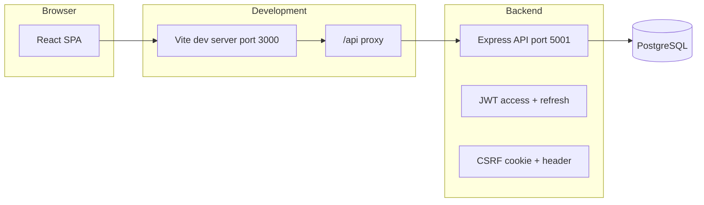
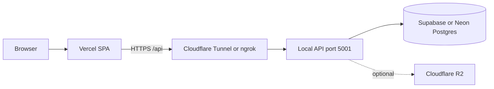
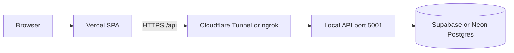

# Web-Based Attendance System

This document is the **operator and user manual** for the Web-Based Attendance System: what it does, how to install and configure it, and how to use the web application day to day.

**Default demo login** (fresh database seed — see [§7](#7-default-demo-accounts-fresh-install)): `admin` / `Admin123456`, `employee` / `Employee123456`.

---

## 1. What this system is

The Web-Based Attendance System is a **full-stack HR and attendance** application. Staff record check-in and check-out with **GPS verification** against configured **office locations** (or field check-in sites). Administrators manage users, payroll, leave, loans, and **field operations** (petugas lapangan delivery codes, pabrik rates, and omset reporting).

**Typical use**

- Staff open the site on a phone or laptop, sign in, and use one button to **check in** or **check out** (the app chooses the correct action based on role and whether they already have an open session).
- **Staff kantor** (`employee`) may mark **remote work** on check-in when allowed. **Petugas lapangan** (`field_officer`) check out with structured delivery data and may be assigned to **multiple locations**.
- Administrators maintain **users**, **payroll** (monthly periods, allowances, deductions, slip export), **leave requests**, **loan approvals**, and **field ops** (locations, checkout codes, pabrik item rates). Attendance can be exported to Excel and reviewed on the organization dashboard.

**Roles**

| Role | Purpose |
|------|---------|
| **admin** | Full admin console: users, attendance, payroll, leave, loans, field ops, exports, dashboard. |
| **employee** | Staff kantor — clock in/out (two or four clocks per day), optional remote work, payslips, loans, leave. |
| **field_officer** | Petugas lapangan — one in/out per day, multiple assigned locations, structured checkout with delivery codes. |
| **umum** | One check-in per day (auto close); monthly payroll with absence deductions. |
| **accounting** | Custom work hours; monthly payroll similar to staff kantor. |
| **head_of_finance** | No attendance; admin enters payroll manually. Can open **Field omset** (`/finance/field-omset`). |

Each login (except admin) is tied to an **employee profile** (name, employee code, and HR-related fields).

**Important technical facts**

- Data is stored in **PostgreSQL** (not SQLite).
- The backend runs **database migrations and demo seed data automatically on startup** when the server starts successfully.
- The API is versioned under **`/api/v1`** and is documented with **Swagger UI** at **`/api-docs`** on the backend host.

---

## 2. Architecture at a glance



- **Frontend**: React (Vite), Tailwind CSS, React Router, i18next (English / Indonesian), Recharts on the admin dashboard.
- **Backend**: Node.js, Express 5, `pg` (PostgreSQL), JWT authentication, CSRF protection for mutating requests, optional request activity logging, rate limiting.
- **Integration**: In development, the frontend calls **`/api/...`**, which Vite **proxies** to `http://127.0.0.1:5001` so cookies and paths align.

---

## 3. Prerequisites

- **Node.js** (current LTS recommended) and **npm**.
- **PostgreSQL 16** (or compatible), either:
  - via **Docker** (recommended for local development), or  
  - a local install whose connection string you put in `backend/.env`.

---

## 4. Installation

### 4.1 Get the code

Clone this repository to your machine.

### 4.2 Start PostgreSQL

From the **repository root**:

```bash
docker compose up -d
```

This starts PostgreSQL **16** with:

- user: `attendance`  
- password: `attendance`  
- database: `attendance`  
- port: **5432**

(Adjust if you use your own Postgres instance.)

### 4.3 Configure the backend

```bash
cd backend
cp .env.example .env
```

Edit **`backend/.env`** as needed (see [Section 6](#6-configuration-reference-backendenv)). At minimum, ensure **`DATABASE_URL`** matches your database.

### 4.4 Install dependencies

```bash
cd backend && npm install
cd ../frontend && npm install
```

### 4.5 First startup (migrations and seed)

Starting the backend **runs migrations and seed data** (`backend/src/db/migrate.js`):

```bash
cd backend && npm start
```

If Postgres is not reachable, the server prints diagnostic hints (for example: start Docker Compose or create the role/database manually).

---

## 5. Running the application

### 5.1 Development (recommended)

**Terminal 1 — API**

```bash
cd backend && npm start
```

Default API URL: **`http://127.0.0.1:5001`**

- Health check: `GET http://127.0.0.1:5001/health`
- OpenAPI UI: `http://127.0.0.1:5001/api-docs`

**Terminal 2 — Web UI**

```bash
cd frontend && npm run dev
```

The Vite dev server listens on **port 3000** and proxies **`/api`** to the backend (`frontend/vite.config.js`).

Open **`http://localhost:3000`** in the browser.

### 5.2 Optional: backend in watch mode

```bash
cd backend && npm run dev
```

(requires `nodemon`)

### 5.3 Production-style frontend build

```bash
cd frontend && npm run build
```

The static output is under **`frontend/dist`**. If the UI is **not** served from the same origin as the API, set **`VITE_API_BASE`** at build time to the full API prefix (for example the public URL that serves `/api/v1`). The default in code is **`/api`**, which assumes a reverse proxy or same-host deployment.

---

## 6. Configuration reference (`backend/.env`)

| Variable | Typical meaning |
|----------|------------------|
| `PORT` | API port (default **5001**). |
| `NODE_ENV` | `development` or `production`. |
| `DATABASE_URL` | PostgreSQL connection string (required for a real database). |
| `JWT_SECRET` | Secret for signing access tokens (**change in production**). |
| `COOKIE_SECRET` | Secret for signed cookies (CSRF); defaults to `JWT_SECRET` if unset. |
| `ALLOWED_ORIGINS` | Comma-separated browser origins allowed by CORS (e.g. `http://localhost:3000`). Empty means permissive for origins (still subject to browser rules). |
| `COOKIE_SAME_SITE` | CSRF cookie `SameSite` (`lax` locally; use **`none`** when UI and API are on different hosts, e.g. Vercel + local API). |
| `DATABASE_SSL` | Set to `true` to force TLS to Postgres (auto-enabled for Neon URLs and `sslmode=require`). |
| `SERVE_FRONTEND` | `false` when the API does not serve `frontend/dist` (split hosting). |
| `CSRF_ENABLED` | Set to `false` to disable CSRF checks (not recommended in production). |
| `ACTIVITY_LOG_ENABLED` | Set to `false` to disable HTTP activity logging middleware. |
| `ACCESS_TOKEN_TTL_SEC` | Access token lifetime in seconds (default **900** = 15 minutes). |
| `REFRESH_TOKEN_TTL_DAYS` | Refresh token lifetime. |
| `BCRYPT_ROUNDS` | Cost factor for password hashing. |
| `PASSWORD_MIN_LENGTH` | Minimum password length (default **6**). Passwords must be letters and numbers only. |
| `OFFICE_RADIUS_METERS` | Base allowed distance from the office pin for on-site check-in (default **500** m in `.env.example`). |
| `OFFICE_RADIUS_GPS_BUFFER_CAP_METERS` | Extra tolerance from GPS uncertainty, capped (see [Section 10](#10-attendance-and-gps-rules)). |
| `MAX_GPS_ACCURACY_METERS` | Reject clock events if reported accuracy is worse than this (default **250** m). |
| `MAX_CLIENT_CLOCK_SKEW_MS` | Reject if device time differs from server by more than this (default **5 minutes**). |
| `MAX_IMPOSSIBLE_SPEED_MPS` | Reject if implied speed from last fix to current fix exceeds this (default **50** m/s). |
| `RATE_LIMIT_WINDOW_MS` / `RATE_LIMIT_MAX` | Global API rate limit window and max hits. |
| `LOG_LEVEL` | Winston log level (`info`, etc.). |

---

## 7. Default demo accounts (fresh install)

After a successful first migration + seed, these accounts exist (see comments in `backend/.env.example`):

| Username   | Password            | Role     |
|-----------|---------------------|----------|
| `admin`   | `Admin123456`   | admin    |
| `employee`| `Employee123456` | employee |

The demo employee is linked to profile **`EMP001`** / **Demo Employee** and to the first office in the database (seed includes **RS Darmo** with coordinates from a Google Maps short link).

**Security**

- Change passwords immediately in any shared or production environment.
- Set strong, unique **`JWT_SECRET`** and **`COOKIE_SECRET`**.

---

## 8. Using the web application

### 8.1 Language

Use **EN** and **ID** in the header to switch **English** and **Indonesian**. Preference is handled by i18next in the browser.

### 8.2 Login

1. Open **`/login`** (or the site root, which redirects to login).
2. Enter **username** and **password**.
3. On success:
   - **admin** → `/admin`
   - **employee** → `/employee`

The app stores the **access token** and **refresh token** in `localStorage` and sends the access token on API requests. If the access token expires, the client attempts a **refresh** flow automatically.

### 8.3 Logout

Use **Logout** on the dashboard. The client calls the logout endpoint with the refresh token when possible, then clears local storage.

### 8.4 Employee dashboard (`/employee`)

**What you see**

- **Today’s status**: current attendance status, expected shift label, and progress toward the number of clock events required today (**two** for a single-segment day = one in + one out; **four** for a split day = two segments × in/out).
- **Week hours**: rolling sum of recorded work hours for the week.
- **Clock actions**: assigned office name, optional **Remote work day** checkbox (only on check-in and only if allowed), and the main **Check in / Check out** button.
- **My payroll**: monthly salary rows after an administrator generates payroll (days attended, basic pay, deductions, final pay).
- **Loans**: submit loan requests and track repayment (potong gaji) once payroll is run.
- **History**: past attendance rows with office name, status, and timestamps.

**How to check in or out**

1. Allow the browser to use **location** when prompted (high accuracy is requested).
2. If you are checking **in** and your account allows remote work, decide whether to enable **Remote work day**:
   - **Enabled**: GPS distance to the office is **not** enforced (you are still subject to GPS quality, clock skew, and speed checks).
   - **Disabled**: you must be within the configured **radius** of your assigned office (see [Section 10](#10-attendance-and-gps-rules)).
3. Press the main button. The label shows **Check in**, **Check out**, or **Day complete** depending on state.

**Typical errors (employees)**

- **No office assigned**: an admin must set your office on your user account.
- **Not within radius**: move closer, wait for a better GPS fix, or ask an admin to verify the office map pin / radius settings.
- **GPS accuracy too poor**: go outdoors or near a window; accuracy must be at or better than `MAX_GPS_ACCURACY_METERS`.
- **Device clock skew**: set automatic date/time on the device.
- **Movement speed rejected**: can occur if the previous and current locations imply impossible travel in the elapsed time.

### 8.5 Admin dashboard (`/admin`)

**Overview**

- **Summary cards**: total active employees, present-like today, late today, absent today (absence is derived as employees who have not checked in today versus headcount).
- **Attendance chart**: last **30 days** of present-like vs late counts.
- **Payroll summary**: recent periods with row counts and totals, plus a link to **Payroll** (`/admin/payroll`).

**Exports**

- **Professional report** (`absen_hjs.xlsx`): Indonesian-formatted summary workbook (name, working days, etc.) for a default rolling window (see API for optional date range).
- **Excel export** (`attendance.xlsx`): spreadsheet built from the full attendance export query.

**Users**

- **Add user**:
  - **Employee** accounts require **full name**, **office**, and a password meeting the **password policy**.
  - Options: **allow remote work**, **clock mode**:
    - **Two clocks per day** (one segment): fixed reference shift **07:15–16:00** with a **60** minute break for late / hours calculations in the service layer.
    - **Four clocks per day** (split shift): configure morning and afternoon **start/end** times; the employee completes **two** in/out pairs per calendar day.
  - On success, the message may include the new **employee code** generated for that person.
- **Edit user**: update username, role, office, remote flag, split times (for employees), and full name as applicable.
- **Change password**: admin sets a new password for a user (subject to the same complexity rules).
- **Delete user**: removes the user (understand impact on audit linkage before doing this in production).

**Attendance tables**

- Global attendance list and **per-user** attendance (select a user to load history). Admins can **edit check-in and check-out times** on existing rows.

### 8.6 Field operations (`/admin/field`)

Use **Field ops** in the admin header for petugas lapangan workflows:

- **Locations (offices)**: add check-in sites from **Google Maps links** (`backend/src/utils/mapsLink.js` resolves coordinates). Delete locations when no longer needed.
- **Field checkout codes**, **pabrik catalog**, and **item rates** for delivery reporting.
- Field attendance and delivery data tied to assigned locations.

### 8.7 Leave (`/admin/leave`)

- Review **pending**, **approved**, and **rejected** leave requests; approve or reject with optional notes.
- Configure annual quotas (medical, unpaid, paternity days).
- Open attached leave documents when employees upload supporting files.

### 8.8 Loans (`/admin/loans`)

- Review and approve or reject **loan requests**.
- Approved loans apply **potong gaji** deductions automatically when payroll is generated.

### 8.9 Payroll (`/admin/payroll`)

Use the **Payroll** item in the admin header (or **Open payroll** on the dashboard).

1. **Choose the month** (`YYYY-MM`, pay month) and click **Generate / refresh from attendance** to create or update a payroll row for every active employee. Each period runs **25th of the previous month through 24th** of the pay month (e.g. May 2026 → 25 Apr–24 May). **Days attended** are counted from check-ins in that range. Salary slips show the same period on the **Periode** line.
2. **Default allowances**: set global transport and diligence amounts (used when an employee has no custom amounts).
3. **Per employee**: open a row to adjust daily wage, tenure allowance, overtime, incentives, transport/diligence eligibility, and other deductions. **Loan deductions** are applied automatically from approved active loans when payroll is generated.
4. **Export**: download an individual **slip** (Excel) or **all slips** for the period.

Employees see finalized periods under **My payroll** on `/employee` after you generate payroll for that month.

### 8.10 Field omset (`/finance/field-omset`)

**Admin** and **head of finance** can open this report for petugas lapangan delivery revenue (omset) from checkout codes.

---

## 9. Password policy

New and updated passwords must be at least `PASSWORD_MIN_LENGTH` characters (default **6**) and contain **only letters and numbers** (`backend/src/utils/passwordPolicy.js`).

---

## 10. Attendance and GPS rules

**On-site check-in**

- Distance from the employee’s **assigned office** coordinates to the reported **lat/lng** must be ≤  
  **`OFFICE_RADIUS_METERS` + min(reported accuracy, `OFFICE_RADIUS_GPS_BUFFER_CAP_METERS`)**  
  (accuracy must be a positive number).

**Trust checks (all clock events)**

- Reported **GPS accuracy** must not exceed `MAX_GPS_ACCURACY_METERS`.
- **Client timestamp** must be present and within `MAX_CLIENT_CLOCK_SKEW_MS` of server time.
- If a **previous** clock location and timestamp exist, implied **speed** must not exceed `MAX_IMPOSSIBLE_SPEED_MPS`.

**Statuses**

- The service computes **late** at check-in against the effective shift start (standard shift or segment start).
- **Early leave** can be set at check-out if leaving materially before the scheduled end.

Exact formulas live in `backend/src/services/attendanceService.js` and helpers under `backend/src/utils/`.

---

## 11. HTTP API and documentation

- **Base path**: `/api/v1`
- **Swagger UI**: `http://<host>:<port>/api-docs`

**Auth-related**

- `GET /api/v1/auth/csrf-token` — obtain CSRF token (also sets cookie as applicable).
- `POST /api/v1/auth/login` — login (CSRF required).
- `POST /api/v1/auth/refresh` — refresh access token.
- `POST /api/v1/auth/logout` — revoke refresh token family.

**Authenticated routes** require `Authorization: Bearer <access_token>` and, for mutating requests, the **`X-CSRF-Token`** header aligned with the CSRF cookie when CSRF is enabled.

---

## 12. Backend capabilities not exposed in the current web UI

The REST API includes additional endpoints defined in `backend/src/routes/v1/protected.routes.js`. The React app covers payroll, leave, loans, field ops, and core attendance; some enterprise-style features are **API-only** today:

- `GET /api/v1/admin/audit-logs`, `GET /api/v1/admin/activity-logs`
- `GET/POST /api/v1/admin/notifications`, `POST /api/v1/admin/notifications/scan`
- `GET/POST /api/v1/admin/departments`
- `GET /api/v1/admin/overtime-requests/pending`, `PUT /api/v1/admin/overtime-requests/:id`
- `GET /api/v1/admin/attendance-corrections/pending`, `PUT /api/v1/admin/attendance-corrections/:id`
- Analytics: `/api/v1/admin/analytics/...`

Use **Swagger** (`/api-docs`) or an API client for these until dedicated UI screens are added.

---

## 13. Troubleshooting

| Symptom | What to check |
|--------|----------------|
| Backend exits on startup with Postgres errors | Docker running? `DATABASE_URL` correct? Port 5432 free? |
| Frontend “network” errors | Backend up? Dev proxy: UI must use **`http://localhost:3000`** so `/api` hits Vite’s proxy. |
| CORS errors in custom setups | Add your UI origin to **`ALLOWED_ORIGINS`**. |
| 403 on POST after login (“security token”) | UI must call **`ensureCsrf`** before login and send **`X-CSRF-Token`**. On Vercel + a remote API, login uses the token from the JSON response (cookies are optional). Restart the API after CSRF changes. On mobile/other browsers, third-party cookies are often blocked — the header must carry the token. |
| Always “not within radius” | Office link coordinates, `OFFICE_RADIUS_METERS`, GPS accuracy indoors. |
| Employee cannot clock | Office assigned? Already completed all segments for the day? Open session still waiting for check-out? |

---

## 14. Technologies

- **Backend**: Node.js, Express, PostgreSQL (`pg`), JWT, express-validator, cookie-based CSRF, Winston, xlsx, Swagger (swagger-jsdoc / swagger-ui-express).
- **Frontend**: React 19, Vite 6, Tailwind CSS, Axios, React Router 7, i18next, Recharts.

---

## 15. Reference: demo office (seed)

The seed creates an office **RS Darmo** using the public short link:

`https://maps.app.goo.gl/x9nEcHGRREfzCiwC9`

Admins can add more offices the same way by pasting **Google Maps links**; the system extracts coordinates where possible.

---

## 16. Running on the internet (production)

Employees need **HTTPS** in the browser for GPS check-in (browsers block precise location on plain `http://` except on `localhost`).

### 16.1 Recommended: managed split stack

Good default for a small team (low cost, minimal ops):

| Piece | Service | Role |
|-------|---------|------|
| **Frontend** | [Vercel](https://vercel.com) (free tier) | Hosts the React SPA (`frontend/`) |
| **Backend** | Your PC (or VPS) | Runs the Node API (`backend/`) |
| **Database** | [Supabase](https://supabase.com) or [Neon](https://neon.tech) | Managed PostgreSQL |
| **Storage** | [Cloudflare R2](https://developers.cloudflare.com/r2/) | Optional — not required today (Excel exports are generated in memory) |



Env templates: **`deploy/split-stack.env.example`**.

#### Step 1 — Database (Supabase or Neon)

**Supabase (recommended if you already use it)**

1. Create a [Supabase](https://supabase.com) project.
2. **Settings → Database → Connection string → URI**.
3. For the Node API on your PC, use **Session pooler** or **Direct** (port **5432**). Avoid Transaction pooler (6543) for this long-running Express app.
4. Set `DATABASE_URL` on the API host to that URI. SSL is auto-enabled for `supabase.co` URLs.

**Neon (alternative)**

1. Create a Neon project and database.
2. Copy the **pooled** connection string (includes `?sslmode=require`).
3. Set `DATABASE_URL` on the API host. SSL is auto-enabled for Neon URLs.

**Note:** Supabase does **not** host this Express API — only PostgreSQL. Edge Functions are Deno-only. Keep the API on your PC (Step 2 below).

On first successful API start, **migrations and seed data** run (same as local dev).

**Migrating from Neon to Supabase:** `pg_dump` from Neon, `psql` restore into Supabase, then point `DATABASE_URL` at Supabase and restart the API. Do not run two APIs against different databases.

#### Step 2 — Local API (backend on your PC)

Run the backend on **your machine** with the UI on **Vercel**.



**Keep your data:** use your existing production **`DATABASE_URL`**. Do **not** start local Docker Postgres for this setup — that would be a separate empty database.

1. **Create `backend/.env`:**
   ```bash
   cp backend/.env.production-local.example backend/.env
   ```
2. **Set production values** in `backend/.env`:
   - `DATABASE_URL` (Supabase or Neon — same string as production)
   - `JWT_SECRET`, `COOKIE_SECRET` (keeps existing logins valid)
   - Any other production vars you customized (`OFFICE_RADIUS_METERS`, etc.)
3. Set **`ALLOWED_ORIGINS`** to your Vercel URL, e.g. `https://your-app.vercel.app`.
4. Keep **`COOKIE_SAME_SITE=none`** and **`SERVE_FRONTEND=false`**.
5. **Install and start the API locally:**
   ```powershell
   # Windows
   .\scripts\start-local-api.ps1
   ```
   ```bash
   # Mac / Linux
   cd backend && npm install && npm start
   ```
6. **Expose port 5001 to the internet** (Vercel cannot call `localhost`):
   - **[Cloudflare Tunnel](https://developers.cloudflare.com/cloudflare-one/connections/connect-networks/)** (free, stable hostname), or
   - **[ngrok](https://ngrok.com/)**: `ngrok http 5001`
7. **Vercel → Environment Variables** → set **`VITE_API_BASE`** to `https://<your-tunnel-host>/api` and **redeploy** the frontend.
8. Check **`https://<tunnel-host>/health`** → `{ "ok": true }`, then open your Vercel URL and log in.

#### Auto-start on Windows (after reboot)

To keep the local stack running after a PC restart **without anyone logging in**, install one or both scheduled tasks (each runs as **SYSTEM** at startup):

| Task | What starts | URL |
|------|-------------|-----|
| **Attendance API Boot** | Backend API (`node server.js`) | `http://127.0.0.1:5001/health` |
| **Attendance Frontend Boot** | Vite dev server (`npm run dev` equivalent) | `http://localhost:3000` |
| **Attendance Tunnel Boot** | Cloudflare tunnel to port 5001 | stable: `tunnel-url.txt` after named setup |

**Prerequisites**

- `backend/.env` exists (same Neon `DATABASE_URL` as above).
- Node.js is available (this repo’s scripts expect `D:\Calvin\node\node.exe` on the production PC; adjust paths in the boot scripts if yours differ).
- For the frontend task: `cd frontend && npm install` once so `node_modules/vite` exists.
- For the tunnel task: `cloudflared.exe` at `D:\Calvin\cloudflared\cloudflared.exe`. For a **stable** public URL, also run `setup-named-tunnel.ps1` with a hostname on your Cloudflare domain.

**One-time install** (PowerShell **as Administrator**, from the repo root):

```powershell
.\scripts\install-backend-boot-task.ps1
.\scripts\install-frontend-boot-task.ps1
.\scripts\install-tunnel-boot-task.ps1
```

The API task waits ~60 seconds after boot, then starts the backend. The frontend task waits ~2 minutes. The tunnel task waits ~2.5 minutes, then starts cloudflared once the API is healthy. Allow **3–4 minutes** after reboot before the full stack is ready.

**Important (Vercel + quick tunnel):** Quick tunnel hostnames **change every restart**. Auto-sync is handled by:

1. **Attendance Tunnel Boot** — starts cloudflared and syncs Vercel when the tunnel is healthy
2. **Attendance Vercel Sync** — fallback task ~5 min after boot (install below)

One-time setup:

```powershell
.\scripts\install-vercel-sync.ps1
# Edit D:\Calvin\cloudflared\vercel-sync.env — add VERCEL_TOKEN from https://vercel.com/account/tokens
.\scripts\install-vercel-sync-boot-task.ps1   # Administrator
.\scripts\sync-vercel-api-url.ps1 -Force      # test once
```

Log: `C:\Users\calvin\.pm2\logs\vercel-sync.log`

For a **stable URL** without redeploys, use a named Cloudflare tunnel with your own domain (`setup-named-tunnel.ps1`).

**Test without rebooting** (Administrator):

```powershell
Start-ScheduledTask -TaskName "Attendance API Boot"
Start-ScheduledTask -TaskName "Attendance Frontend Boot"
Start-ScheduledTask -TaskName "Attendance Tunnel Boot"
Get-Content C:\Users\calvin\.pm2\logs\boot-start.log -Tail 20
Get-Content C:\Users\calvin\.pm2\logs\boot-frontend.log -Tail 20
Get-Content C:\Users\calvin\.pm2\logs\boot-tunnel.log -Tail 20
Get-Content D:\Calvin\cloudflared\tunnel-url.txt
```

**After code updates**, pull and restart the running API (does not reinstall the boot tasks):

```powershell
.\scripts\deploy-backend.ps1
```

Restart the frontend dev server manually after frontend changes (`cd frontend && npm run dev`), or re-run `Start-ScheduledTask -TaskName "Attendance Frontend Boot"`.

Re-run the install scripts only if you change the boot scripts or move the repo path.

**Migrations on startup:** the API only applies additive schema changes and skips demo seed rows that already exist (`ON CONFLICT DO NOTHING`). Your attendance and user data stay intact.

**Local dev (optional):** run `cd frontend && npm run dev` with the API on port 5001, or install **Attendance Frontend Boot** (see [Auto-start on Windows](#auto-start-on-windows-after-reboot)); Vite proxies `/api` to localhost (no tunnel needed for that workflow).

#### Step 3 — Vercel (frontend)

1. Import the repo → set **Root Directory** to **`frontend`**.
2. Framework preset: **Vite** (build: `npm run build`, output: `dist`).
3. **Environment variable** (Production):

| Variable | Value |
|----------|--------|
| `VITE_API_BASE` | `https://<api-host>/api` — tunnel URL or other public API host (must include **`https://`** and **`/api`**) |

4. Deploy. `frontend/vercel.json` rewrites all routes to the SPA for React Router.

**Login shows “405”:** the UI is posting to Vercel instead of the API. Fix `VITE_API_BASE` as above and **redeploy** (Vite bakes env vars at build time).

#### Step 4 — Cloudflare R2 (optional)

The current app does **not** persist files to object storage (payroll/attendance Excel files are built on demand). Add R2 when you need archived exports, attachments, or backups. Wire credentials via `backend/.env` when you implement that feature (`deploy/split-stack.env.example` lists placeholders).

#### After deploy (split stack)

1. Change demo passwords (`admin` / `employee`) immediately.
2. Open the **Vercel** URL on a phone, allow **location**, test check-in.
3. If login returns **403 CSRF** (“security token”), refresh the page, redeploy the latest API, and confirm `ALLOWED_ORIGINS` matches the Vercel URL. `COOKIE_SAME_SITE=none` is still recommended but login works via **`X-CSRF-Token`** when cookies are blocked (common on phones).
4. If check-in says you are outside the office radius, set **`OFFICE_RADIUS_METERS=500`** (or higher) on the API, restart/redeploy, and verify the office **Google Maps pin** matches the real site. The employee page shows live GPS distance when location permission is allowed.
5. Swagger: `https://<api-host>/api-docs`

#### Updates (split stack)

- **Frontend**: push to `main` → Vercel redeploys automatically.
- **Backend (local)**: push to `main` with changes under `backend/` → **GitHub Actions** (`.github/workflows/deploy-backend.yml`) SSHs to your Windows PC and runs `scripts/deploy-backend.ps1` when repo secrets are set (`DEPLOY_HOST`, `DEPLOY_PORT`, `DEPLOY_USER`, `DEPLOY_SSH_KEY`, `DEPLOY_REPO_PATH`). One-time setup: `scripts/setup-github-deploy.ps1`. Manual deploy: `.\scripts\deploy-backend.ps1` after `git pull`.
- After a PC reboot, **Attendance API Boot**, **Attendance Frontend Boot**, and **Attendance Tunnel Boot** start the stack automatically (see [Auto-start on Windows](#auto-start-on-windows-after-reboot)). If using a quick Cloudflare tunnel, check `tunnel-url.txt` and sync `VITE_API_BASE` when the hostname changes.
- **Schema**: migrations run on API startup; no separate migrate job.

---

### 16.2 Alternative: single VPS (Docker + Caddy)

The repo also includes a **Docker Compose** stack: PostgreSQL, Node API (with the built React UI), and **Caddy** for automatic HTTPS on one machine.

**What you need**

1. A **VPS** with Docker and Docker Compose.
2. A **domain** with DNS **A record** to the server.
3. Ports **80** and **443** open.

**Configure and start** (repository root):

```bash
cp .env.production.example .env.production
```

Edit **`.env.production`**: `DOMAIN`, `POSTGRES_PASSWORD`, `JWT_SECRET`, optional `COOKIE_SECRET`.

```bash
docker compose -f docker-compose.prod.yml --env-file .env.production up -d --build
```

- Site: **`https://<DOMAIN>`**
- API: **`https://<DOMAIN>/api/v1`**
- Swagger: **`https://<DOMAIN>/api-docs`**

**Updates:** `git pull` then re-run the `docker compose ... up -d --build` command above.

### 16.3 Quick test without a domain

Use an **HTTPS** tunnel (e.g. [Cloudflare Tunnel](https://developers.cloudflare.com/cloudflare-one/connections/connect-networks/) or [ngrok](https://ngrok.com/)) to your local API after `npm run build` and `SERVE_FRONTEND=true npm start` in `backend`. Add the tunnel URL to **`ALLOWED_ORIGINS`**.

---

*End of manual.*
